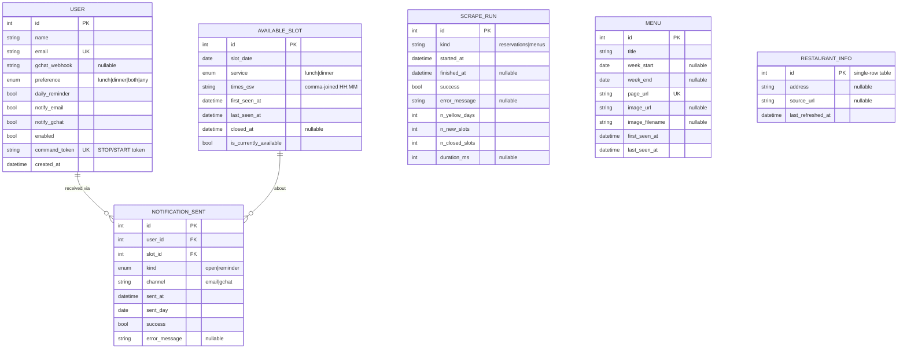
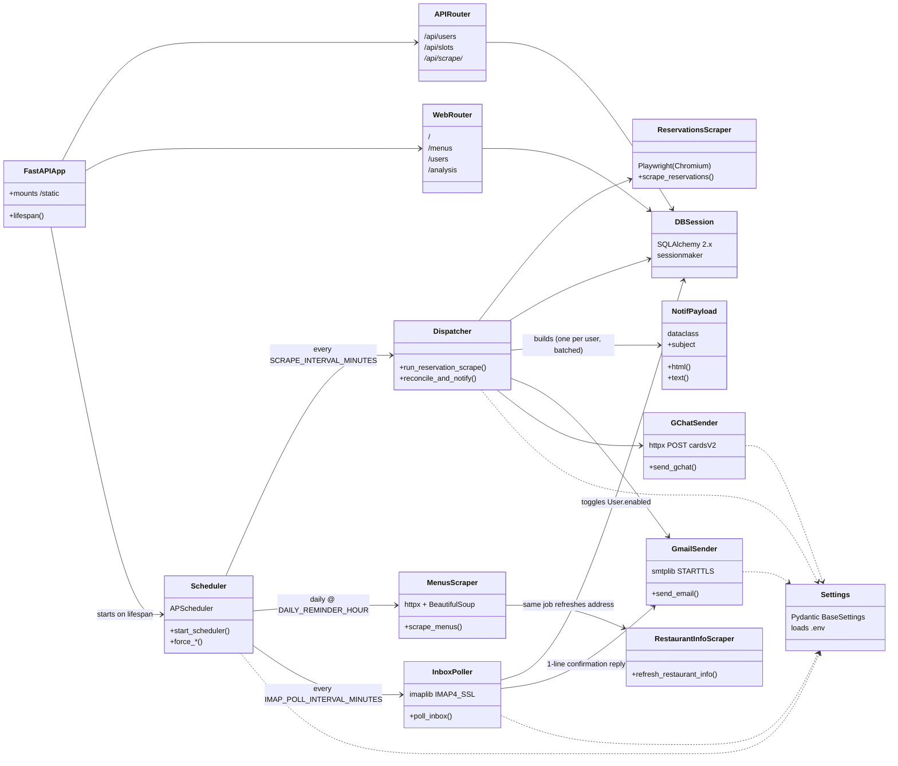
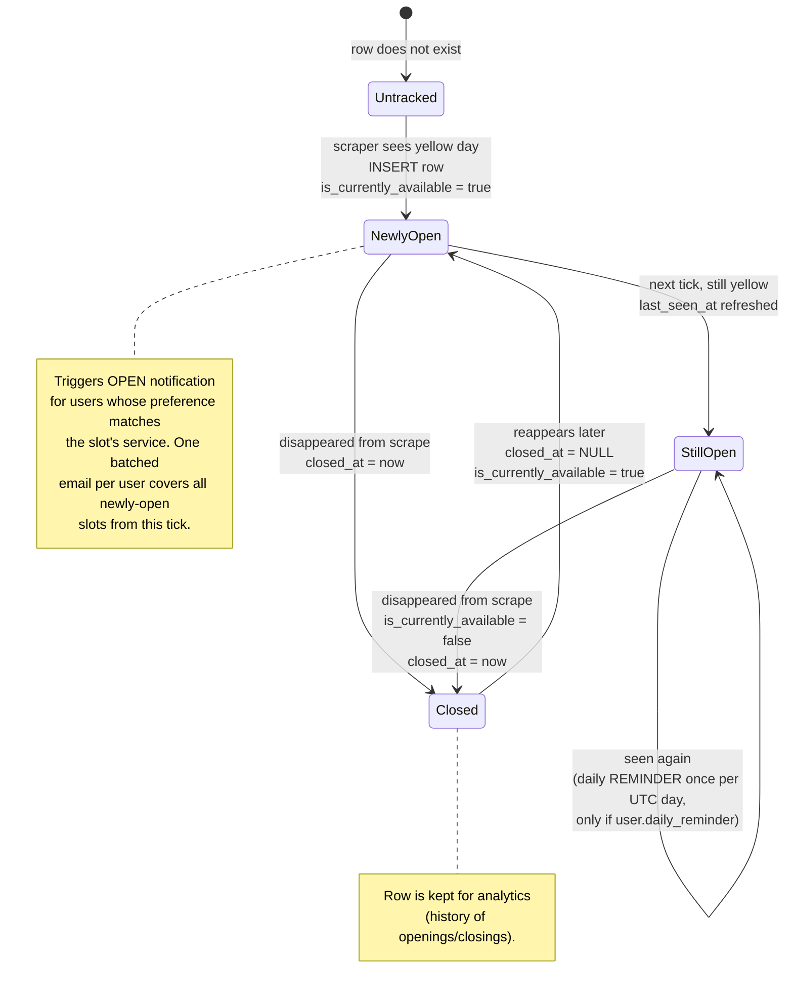
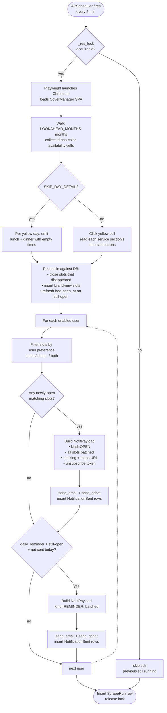
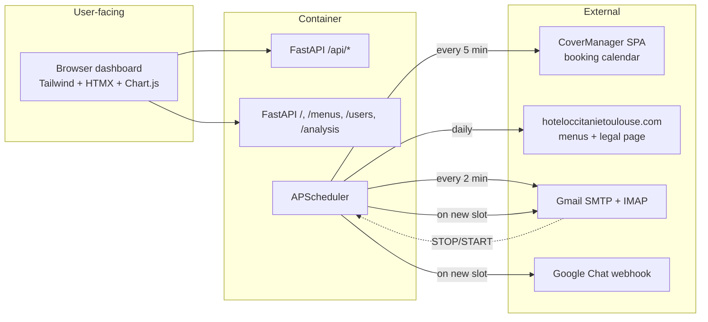

# Architecture

Visual reference for how the watcher is laid out. All diagrams are Mermaid —
GitHub renders them inline.

---

## 1. Database schema (ERD)

Six tables, two foreign keys. SQLite, single file at `/data/lycee.sqlite`.

**Notes**
- `(slot_date, service)` is unique on `AVAILABLE_SLOT` — one row per
  date×service, lifecycled in place rather than re-inserted.
- `NOTIFICATION_SENT` is the dedup ledger: the daily-reminder job checks
  `(user_id, slot_id, kind=REMINDER, sent_day=today)` before sending.
- `SCRAPE_RUN`, `MENU`, `RESTAURANT_INFO` are standalone — no FKs.

---

## 2. Component & class relations (UML)

How the runtime modules wire together. Solid arrows = "uses", dashed = "reads
config from".

**Single source of truth:** every module reads `Settings` (lazy-cached via
`get_settings()`), so `.env` changes only matter on container restart.

---

## 3. AvailableSlot lifecycle (state machine)

The core state machine. Each `(date, service)` pair owns a single DB row that
moves between these states across scrape ticks.

**Reminder dedup:** the `Closed → NewlyOpen` transition resets the day
counter, so a slot that closed and reopened the same day can re-trigger an
OPEN notif but the daily REMINDER is still capped to once per `sent_day`.

---

## 4. Runtime: one reservation-scrape tick

How a single scheduler tick flows from "wake up" to "DB committed". The
menu-scrape and IMAP-poll jobs follow the same lock-then-work shape; only the
reservation tick is detailed here.

**Concurrency:** `_res_lock`, `_menu_lock`, `_inbox_lock` (one per job kind)
prevent overlapping runs. Cross-job overlap is allowed — IMAP polling can run
mid-scrape without contention because each one holds its own SQLAlchemy
session.

---

## Side channels

Two side processes sit outside the main scrape loop:

